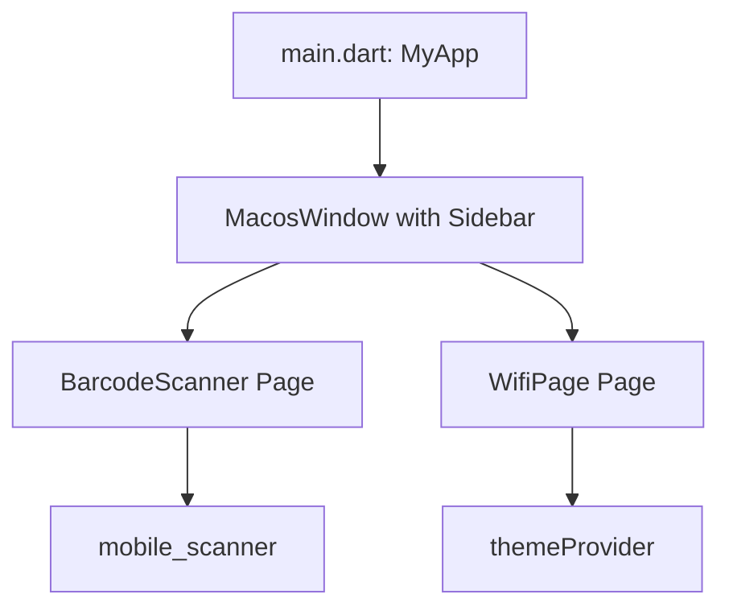

# Architecture

## Architecture Pattern
The project uses a structured Flutter pattern separating core utilities and widgets from the presentation layers.

## Layers

### 1. Core Layer (`lib/core/`)
- **`constants`**: Stores routing strings (`RouteConstants.home`).
- **`utils`**: Contains theme helper methods (`theme_utils.dart`) to check dark/light mode.
- **`widgets`**: Custom reusable UI components, e.g. `MacosCard.dart`.

### 2. Presentation Layer (`lib/presentation/`)
- **Pages**:
  - `Home` (`home_page.dart`): The main window layout featuring a navigation `Sidebar` and content display area.
  - `BarcodeScanner` (`qrcode_scanner.dart`): Implements camera detection for QR scanning.
  - `WifiPage` (`wifi_page.dart`): Generates a custom QR code for connecting to a WiFi network.
- **Providers**: Manages application state, such as dark/light mode toggle via Riverpod (`themeProvider`).
- **Router**: Configures routing mechanisms using `AppRouter` and `RouteGenerator`.

---
*Date mapped: 2026-06-14*
