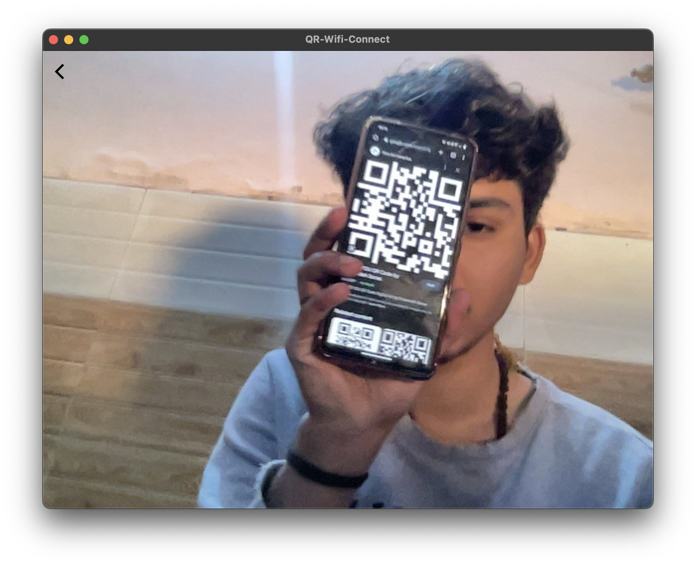

# Wifi Qr connect (Mac OS)

Since every device has this option I was annoyed why my Mac doesn't have this feature, sometime its really hard to find the right wifi in heavy zone like Universities.

This App will help you to connect to wifi using "Share Wifi using QR code", most android device has this feature to share the Wifi network using QR code.

## Installation

### MacOS

* [**dmg download**](https://github.com/anoying-kid/Wifi-Qr-Connect/releases/tag/v0.1.0) : Pre-release

### Git clone

* Clone this repo.
```
git clone https://github.com/anoying-kid/Wifi-Qr-Connect.git
```

## Images

<p>
    
    
</p>

[LICENSE](./LICENSE)

**SADLY, BUY ME COFFEE NOT WORKING PROPERLY**