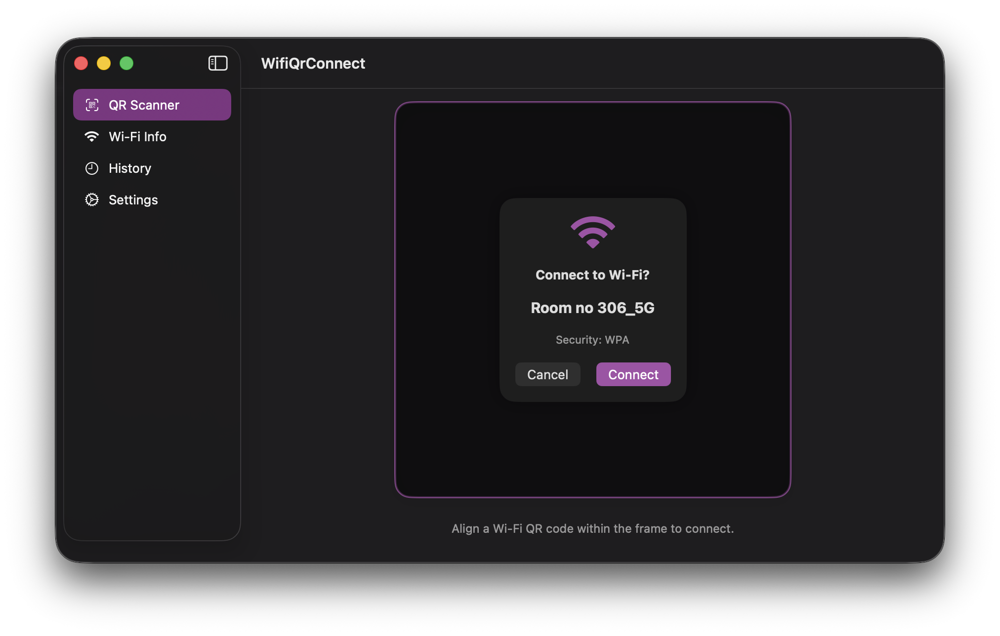
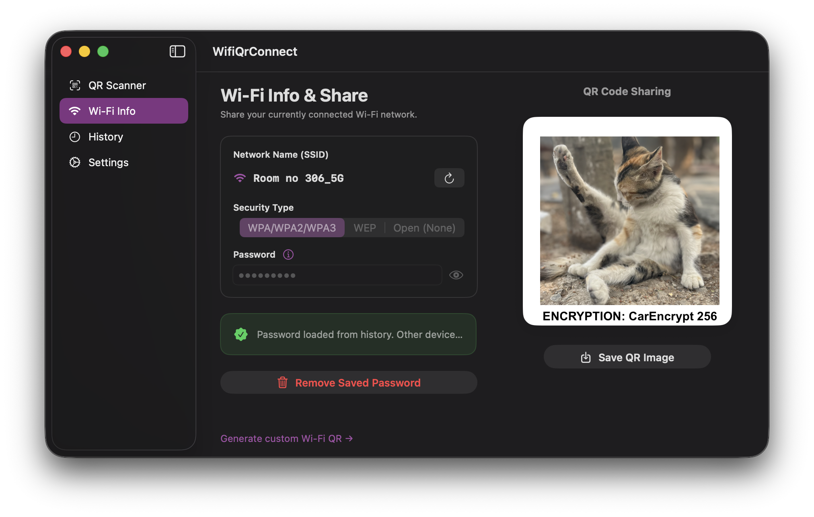
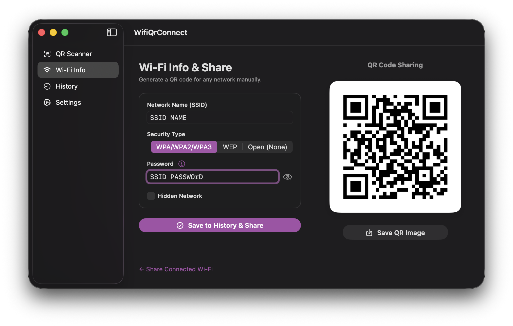
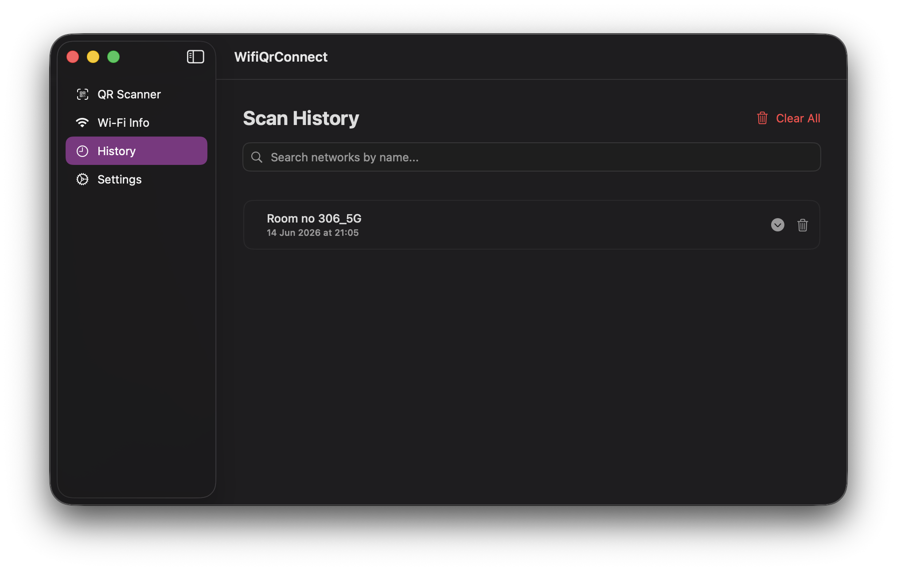
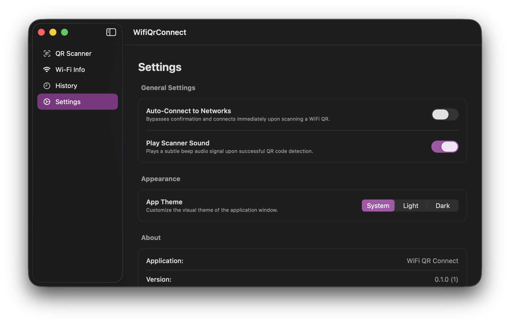

# WiFi QR Connect (macOS)

[](LICENSE)
[](#requirements)

Connecting your Mac to a new Wi-Fi network should be as simple as scanning a code. While most mobile devices support "Share Wi-Fi using QR code" natively, macOS lacks a built-in mechanism to scan these codes or generate them for others. 

**WiFi QR Connect** is a native macOS application built with SwiftUI that bridges this gap. It allows you to scan Wi-Fi QR codes using your Mac's camera to connect instantly, and lets you generate QR codes to share your own networks.

https://github.com/user-attachments/assets/b9e097c5-d9ae-4814-be1a-3fbfc5d93dea

---

## Key Features

- **📷 Built-in Camera QR Scanner**: Align any standard Wi-Fi QR code within the scanner frame to connect automatically.
- **⚡ Auto-Connect**: Toggle auto-connection in settings to connect immediately upon detection without waiting for confirmation.
- **📶 Share Connected Wi-Fi**: Automatically detects your active network and generates a sharing QR code (uses secure local history lookup for passwords to respect macOS sandboxing).
- **🔧 System Settings Integration**: Direct deep-links to macOS Wi-Fi Settings let you easily lookup and copy passwords when needed.
- **✏️ Custom QR Generator**: Manually create QR codes for any network specifying SSID, security type (WPA/WPA2/WPA3, WEP, Open), and hidden status.
- **🕒 Local History**: Securely save scanned and generated networks locally to recall passwords or share them again instantly.
- **🎨 Modern macOS Styling**: Fully native interface adopting macOS Liquid Glass aesthetics, dark mode support, and customizable system themes.

---

## Screenshots

<p align="center">
  
  
</p>
<p align="center">
  
  
</p>
<p align="center">
  
</p>

---

## Installation & Setup

### App Download
You can download the latest pre-packaged App/DMG from the Releases page:
* [**Download Latest Release (DMG)**](https://github.com/anoying-kid/Wifi-Qr-Connect/releases)

### Building from Source

#### Requirements
- macOS 13.0+
- Xcode 14.0+ (with Command Line Tools)
- Swift 5.8+

#### Steps
1. Clone the repository:
   ```bash
   git clone https://github.com/anoying-kid/Wifi-Qr-Connect.git
   cd Wifi-Qr-Connect
   ```

2. Compile and run the application using the local packaging script:
   ```bash
   ./Scripts/compile_and_run.sh
   ```
   This script handles compiling the Swift package, embedding required entitlements (e.g. Camera & CoreWLAN permissions), packaging it into `WifiQrConnect.app`, signing it, and launching it.

---

## How It Works

### Scanning a Code
1. Open the app and select the **QR Scanner** tab.
2. Grant camera permissions when prompted.
3. Hold up a Wi-Fi QR code (from another phone or printed sheet) to your camera.
4. If **Auto-Connect** is disabled, click the **Connect** button. If enabled, the app will join the network instantly.

### Sharing Your Connected Wi-Fi
1. Open the **Wi-Fi Info** tab.
2. The app detects your current network name (SSID).
3. If you have connected to this network using the app before, the password is loaded from secure local history, generating the QR code immediately.
4. If not found in history:
   * Click **Open Wi-Fi Settings** to open the macOS system settings.
   * View the password details, copy it, and paste it into the app.
   * Toggle **Save to History & Share** to store the password securely so it auto-loads next time.

---

## License

Distributed under the MIT License. See [LICENSE](LICENSE) for more information.

---

## Support

If you find this project useful, you can buy me a coffee here:

[](https://buymeacoffee.com/anoyingKid)